# 💊 LifeTag  
**From hospital shelves to patient hands — safe every step**

LifeTag is a **smart digital medicine safety and traceability system** designed to ensure safe, verified, and monitored medicine usage across patients, doctors, and pharmacies using **QR-based prescriptions, real-time alerts, and AI-driven adherence monitoring**.

---

## 🚀 What This Project Does

LifeTag creates a **connected and intelligent medicine ecosystem** that:
- ✔ Prevents expired or unauthorized medicine dispensing  
- ✔ Reduces missed doses, double-dosing, and misuse  
- ✔ Enables real-time expiry & recall alerts  
- ✔ Connects doctors, pharmacies, and patients on a single platform  

The system ensures **accountability, safety, and compliance** throughout the medicine lifecycle.

---

## 🧠 Framework Overview (LifeTag Pipeline)

1. 🧾 **Digital Prescription Generation**  
   Each prescription is issued with a unique **QR code** linked to medicine, batch, and expiry details.

2. 🏪 **Pharmacy Verification**  
   Chemists scan QR codes before dispensing to verify:
   - Valid prescription
   - Non-expired medicine
   - Authentic records

3. 🔔 **Automated Alerts & Notifications**  
   Expiry, recall, and safety alerts sent via **email / app notifications**.

4. 🤖 **AI-Powered Adherence Monitoring**  
   Detects missed doses, double-dosing, and irregular intake patterns.

5. 📊 **Centralized Dashboard**  
   Unified digital dashboard for doctors, patients, and pharmacies.

---

## 📂 Dataset Used

- Digital prescription records  
- Medicine inventory data (batch, expiry, quantity)  
- Patient medication logs  
- CSV-based structured storage for backend processing  

---

## ⚙️ Models & Methods (High-Level)

- 📱 **Frontend:** Flutter, React.js  
- 🧩 **Backend:** Flask (Python REST APIs)  
- 📊 **Data Handling:** Pandas, NumPy  
- 🔍 **OCR & Automation:** Tesseract OCR  
- 🔗 **QR Code:** Prescription tagging & validation  
- 📧 **Notifications:** Automated email alerts  

---
## 📊 Results & Screenshots

### 🏠 Landing Page  
Entry point of the LifeTag application.

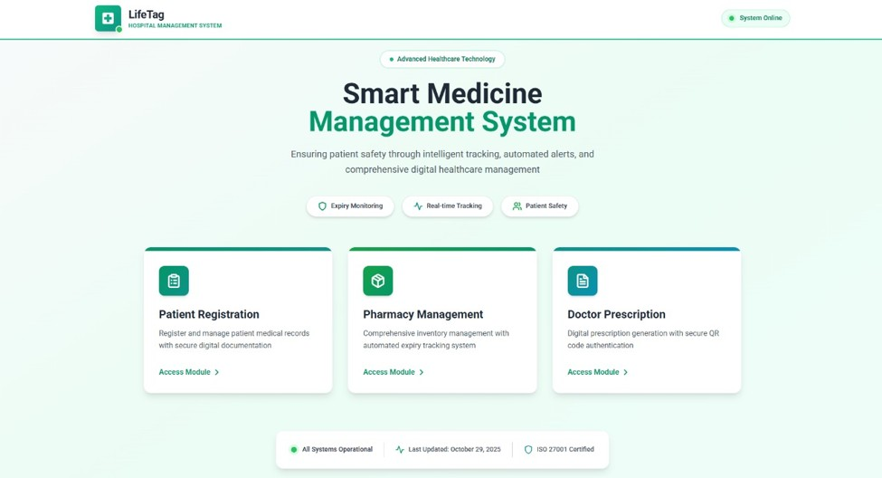

---

### 🧠 System Architecture  
Overall architecture showing interaction between frontend, backend, and alert system.

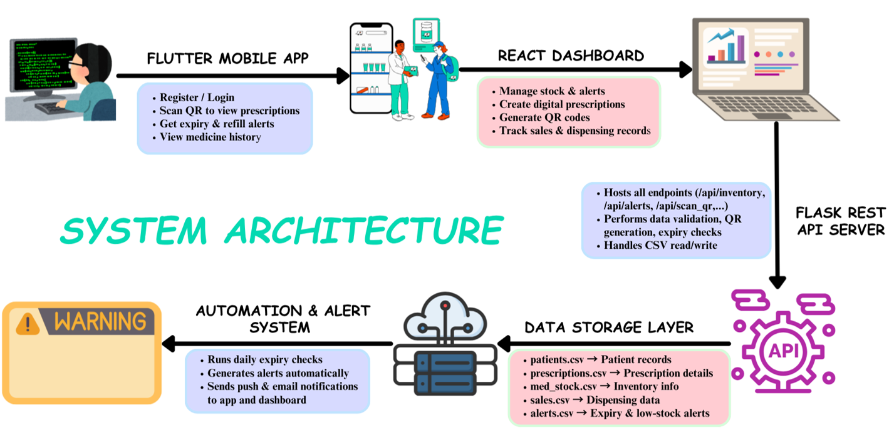

---

### 🔁 Methodology / Workflow  
Step-by-step workflow of the LifeTag system.

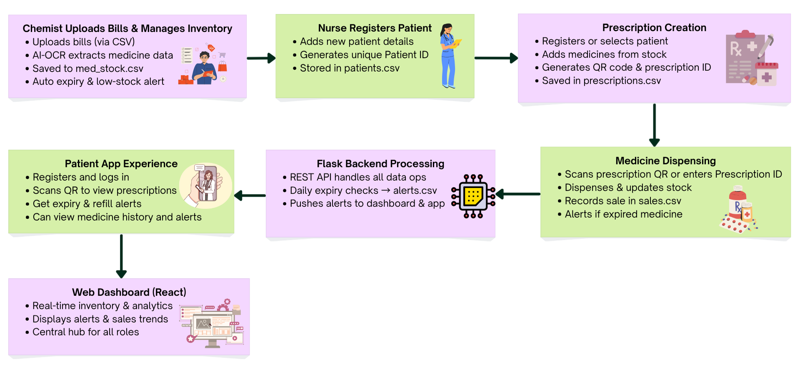

---

### 👤 Patient Registration  
Patient onboarding and registration interface.

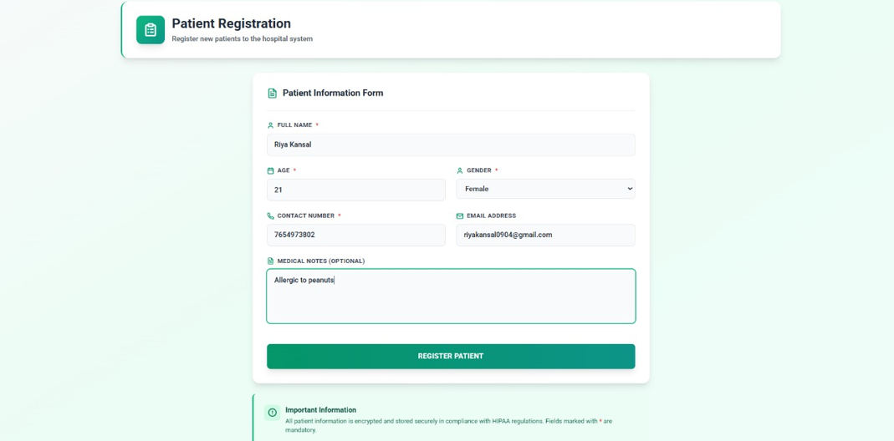

---

### 🏡 Home Page  
Main dashboard view for users after login.

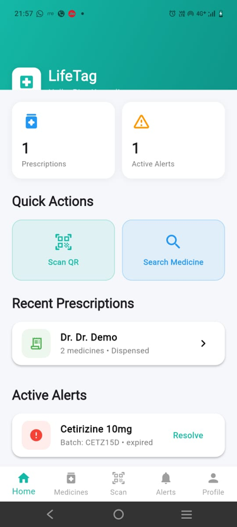

---

### 👤 Profile Page & Update  
User profile view and profile update functionality.

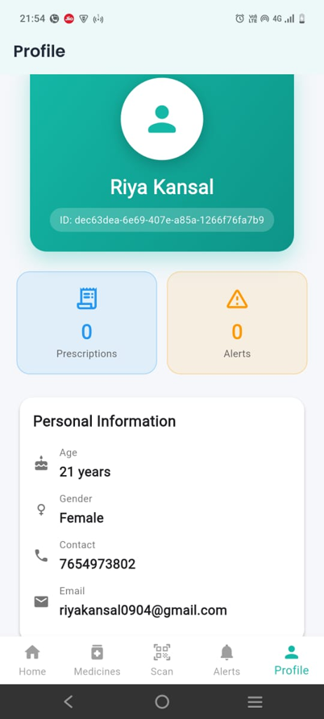  
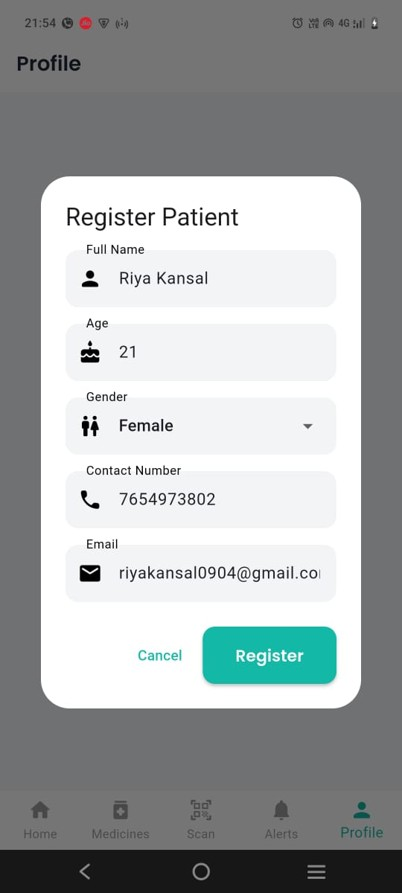

---

### 🩺 Doctor Dashboard  
Doctor-side dashboards for prescription and patient management.

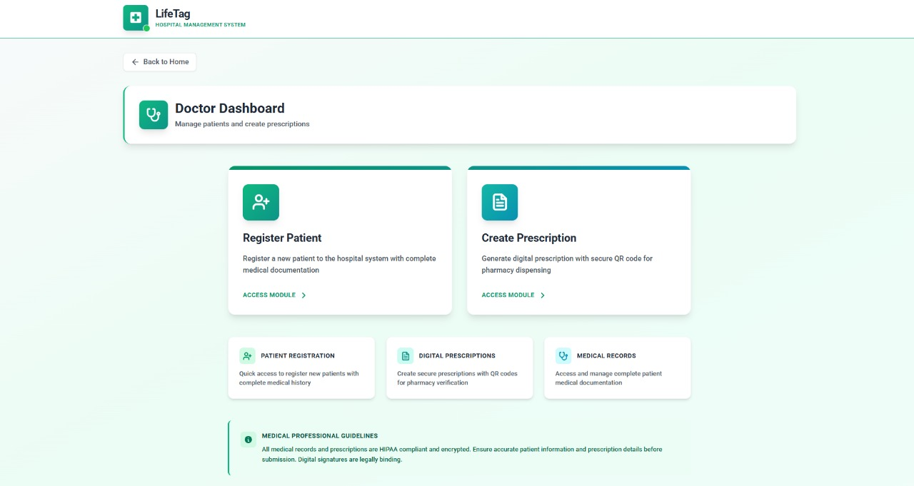  
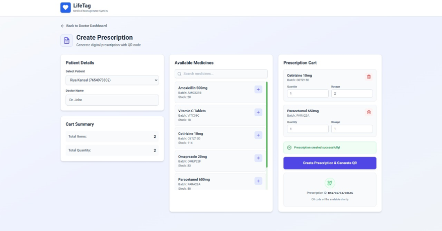  
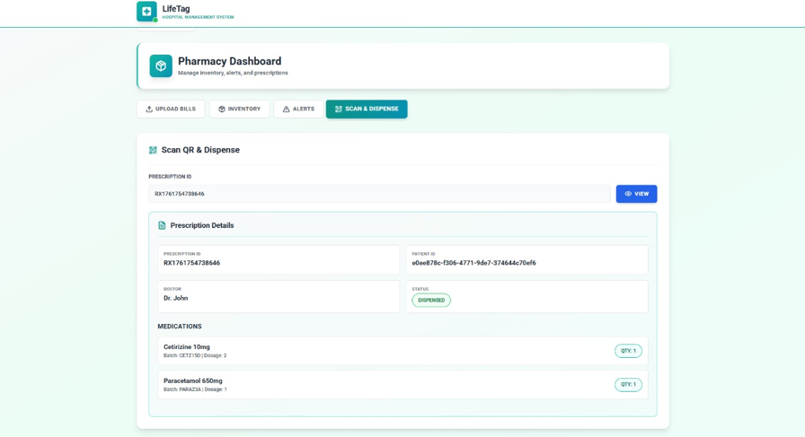

---

### 🏪 Pharmacy Dashboard  
Pharmacy-side dashboards for verification and medicine dispensing.

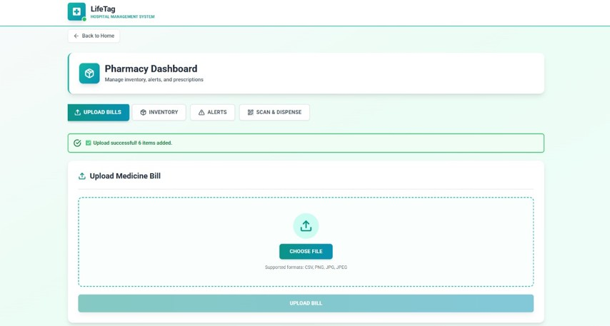  
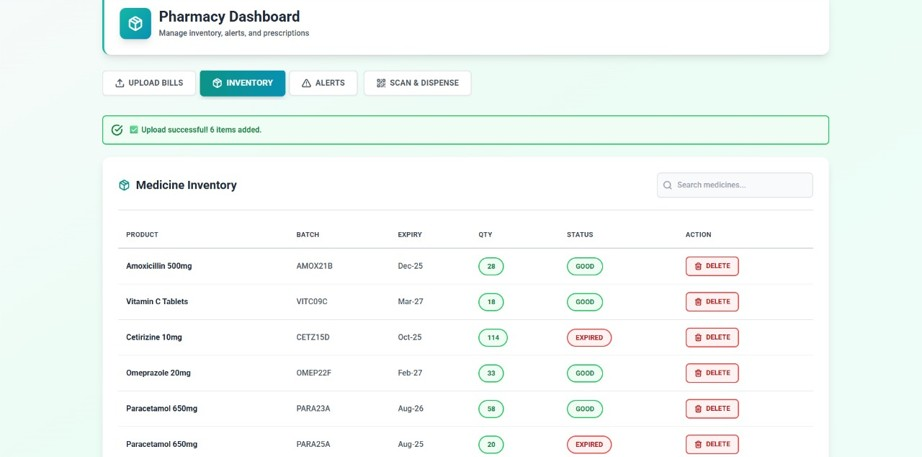  
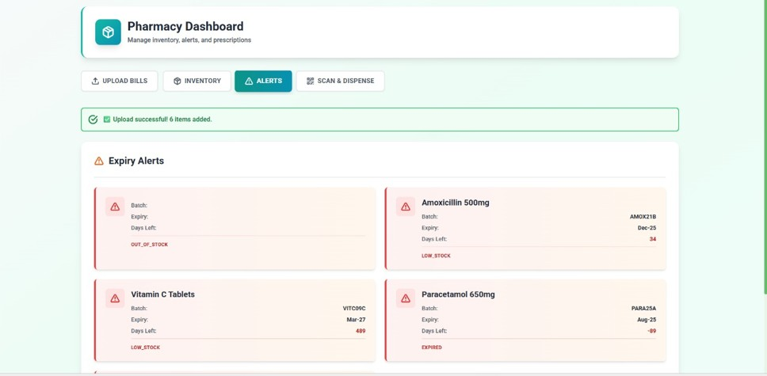

---

### 💊 Medicine Inventory  
Inventory view showing batch, expiry, and stock details.

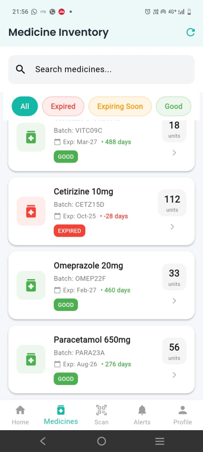

---

### 📄 Prescription Details  
Detailed prescription information linked with QR and expiry.

---

### 🚨 Alerts for Expired Medicines  
In-app alert view for expired or unsafe medicines.

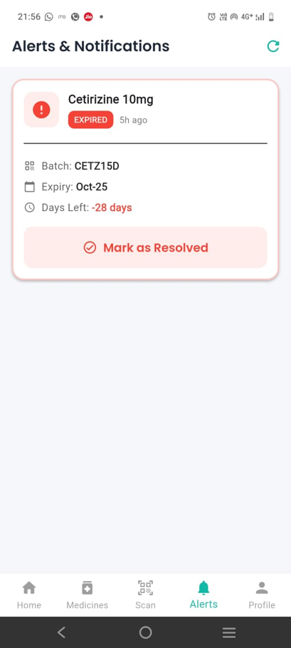

---

### 📧 Alert Notifications (Email)  
Automated email alerts sent to different stakeholders.

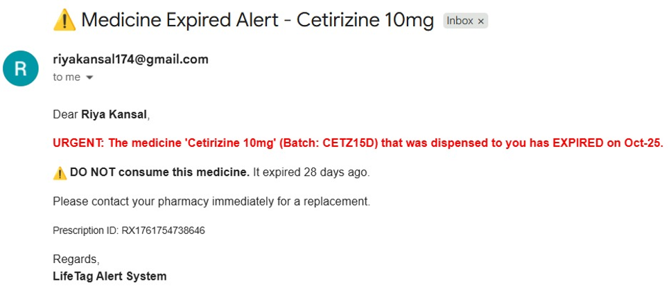  
  

---

## ▶️ How to Run (Optional)

1. Clone the frontend repository  
2. Install frontend dependencies  
3. Configure backend API endpoint  
4. Run the application  

⚠️ Ensure the backend service is running and accessible.

---

## 🔗 Backend Repository

👉 **LifeTag Backend (Flask APIs & Alert System):**  
(https://github.com/riyakansal04/LifeTag-)  

---

## 👩‍💻 Authors

- **Riya Kansal**  
- **Jappanjot Kaur**  

**Mentor:** Dr. Parampreet Kaur  
**Team ID:** 80  

---

## 📄 Citation

If you use or reference this project, please cite it as a **major academic project** developed under Amity School of Engineering & Technology.

---

✨ *LifeTag ensures that every pill tells a safe, verified, and traceable story — from prescription to consumption.*
